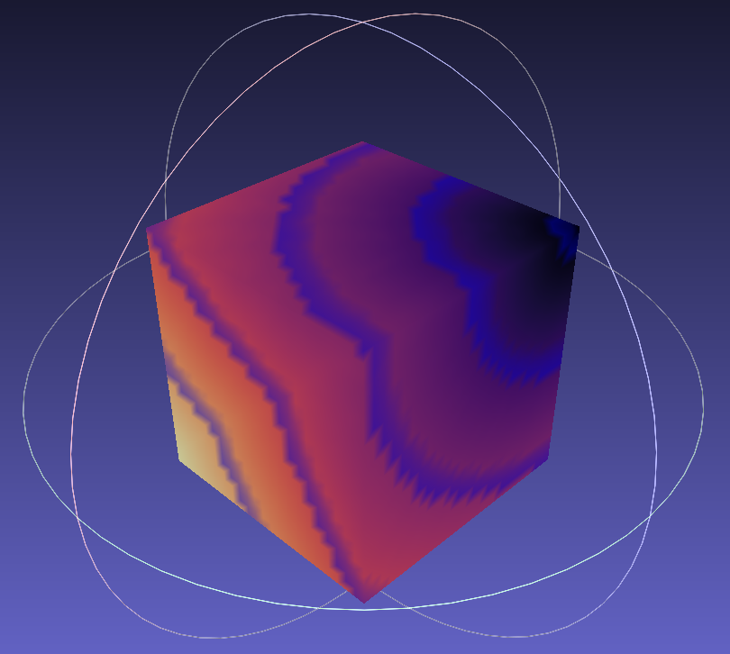

  

# Geodesic Distance Computation Via Source Propagation

Rust reimplementation of [Geodesic Distance Computation via Virtual Source
Propagation](https://www.graphics.rwth-aachen.de/media/papers/334/geodesic-source-propagation.pdf).

Slower than the original (main.cc), but easier to read, since half-edges were removed.

All credit goes to the authors. Originally licensed under the MIT license.

## Basic Usage

This exports a simple binary which can be called on fbx, obj, glb, or a number of other mesh
types. It then outputs a PLY file with colored vertices. One example on a dense triangulated
cube is shown above.
